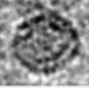

<h1>
  &nbsp;
  Cube'n Tube — Shape Erasers for ChimeraX
</h1>

A ChimeraX plugin that extends the built-in map eraser with three additional eraser shapes: **cube**, **cylinder**, and **custom volume**. All three are accessible from a single unified panel with a shape dropdown.

## Features

- **Cube eraser** — axis-independent box with adjustable X/Y/Z dimensions and optional lock to scale uniformly
- **Cylinder eraser** — frustum with independent top/bottom radii and length, optional radius lock
- **Custom eraser** — use any displayed volume isosurface as the eraser shape, with uniform scaling
- **Single-step undo** (Cmd+Z / Ctrl+Z) for all eraser shapes, including the built-in sphere eraser

## Requirements

- [UCSF ChimeraX](https://www.rbvi.ucsf.edu/chimerax/) 1.11 or later

## Installation


## Usage

After starting ChimeraX the **Cube'n Tube** button appears in the **Right Mouse > Map** toolbar section.

You can also open the panel from the menu: **Tools > Volume Data > CubeNTube**, or via the ChimeraX command line:

```
ui tool show "CubeNTube"
```


1. Open a density map in ChimeraX
2. Click the **Cube'n Tube** button in the Right Mouse toolbar (or open **Tools > Volume Data > CubeNTube**)
3. Select a shape from the dropdown (Cube, Cylinder, or Custom)
4. Adjust dimensions with the sliders
5. Right-click drag to position the eraser over the region of interest
6. Click **Erase inside** or **Erase outside**
7. Press Cmd+Z to undo if needed (Only one undo / redo at a time)

For the **Custom** eraser, first display an isosurface on the volume you want to use as a mask, select it from the dropdown, and click **Set as eraser**.

## Demos

### Cube Eraser

<video src="https://github.com/user-attachments/assets/a6766285-aced-42ff-bcd0-31b29f4fa2b0" autoplay loop muted playsinline controls width="100%"></video>

### Custom Shape Eraser

<video src="https://github.com/user-attachments/assets/7de83679-cb35-4502-84a3-6afa47c0a1d3" autoplay loop muted playsinline controls width="100%"></video>

## Project Structure

```
bundle_info.xml        — Bundle configuration (tools, commands, toolbar button)
src/
  __init__.py          — Entry point: registers mouse modes and patches sphere undo
  undo.py              — Shared VolumeEraseUndo action (single-step undo/redo)
  cube_eraser.py       — Cube model, erase math, mouse mode
  cylinder_eraser.py   — Cylinder model, erase math, mouse mode
  custom_eraser.py     — Custom volume model, erase math, mouse mode
  gui_panel.py         — Unified panel with shape dropdown (QComboBox + QStackedWidget)
```

## References

### Software

- UCSF ChimeraX: Structure visualization for researchers, educators, and developers. Pettersen EF, Goddard TD, Huang CC, Meng EC, Couch GS, Croll TI, Morris JH, Ferrin TE. *Protein Sci.* 2021 Jan;30(1):70-82.

- UCSF ChimeraX: Meeting modern challenges in visualization and analysis. Goddard TD, Huang CC, Meng EC, Pettersen EF, Couch GS, Morris JH, Ferrin TE. *Protein Sci.* 2018 Jan;27(1):14-25.

### Structures used in demos

- **[EMD-26566](https://www.ebi.ac.uk/emdb/EMD-26566)** (cube eraser demo): Newing TP, Brewster JL, Fitschen LJ, Bouwer JC, Johnston NP, Yu H, Tolun G. Red-mediated homologous DNA recombination. *Nat Commun.* (2022).

- **[PDB 9CRD](https://www.rcsb.org/structure/9CRD)** (custom eraser demo): Ke Z, Peacock TP, Brown JC *et al.* Virion morphology and on-virus spike protein structures of diverse SARS-CoV-2 variants. *EMBO J* 43, 6469–6495 (2024). https://doi.org/10.1038/s44318-024-00303-1

## Acknowledgements

Big thanks to the amazing [ChimeraX](https://www.rbvi.ucsf.edu/chimerax/) development team, their extensive documentation made this project possible.

This plugin was developed with AI assistance (Claude / Cursor).

## License

This project is open source, licensed under the [GNU Lesser General Public License v2.1](LICENSE). You are free to use, modify, and redistribute this code.
